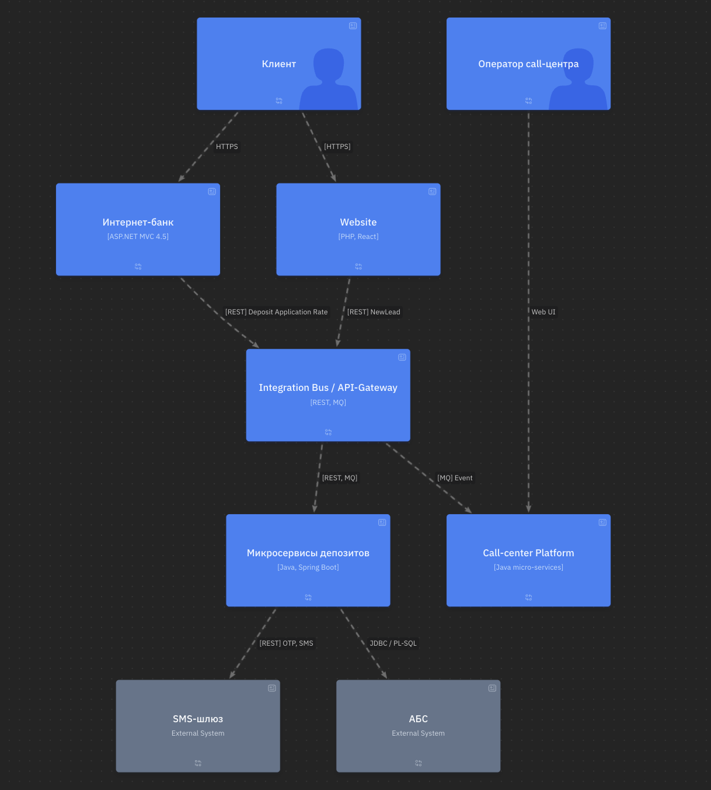
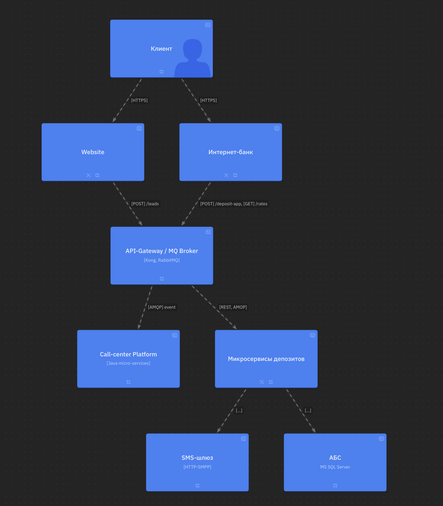
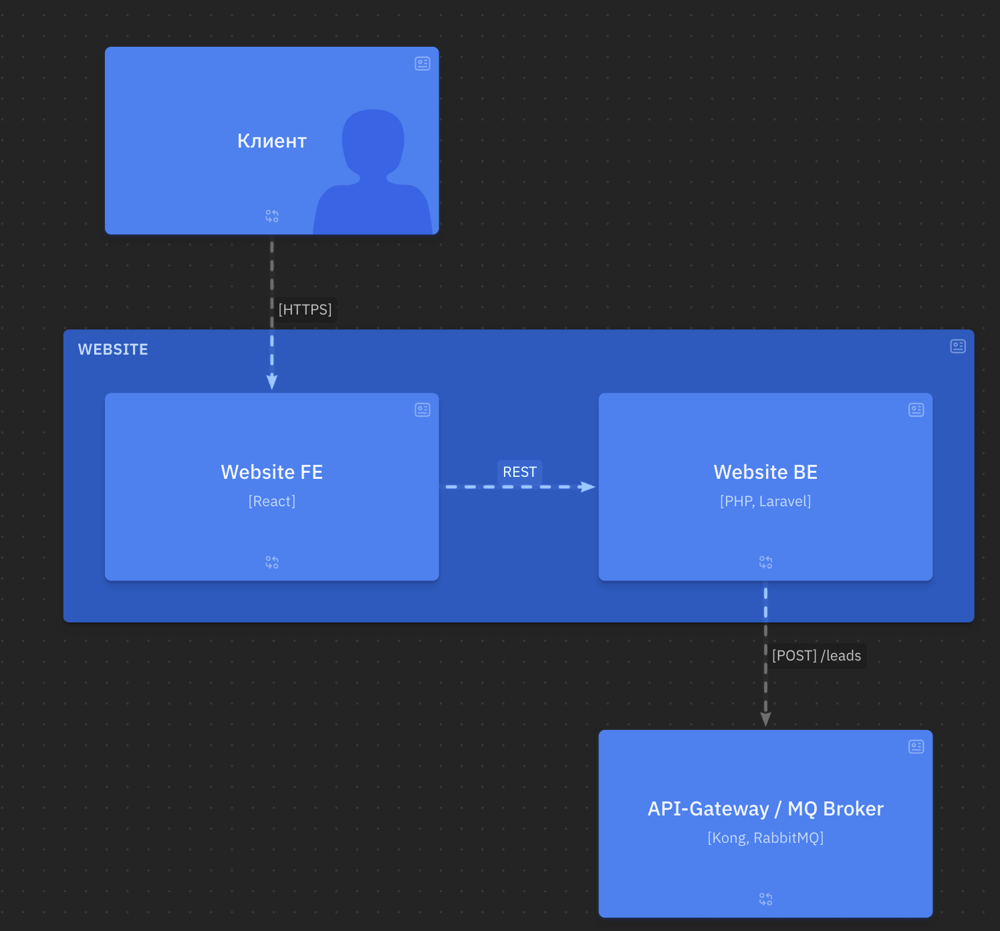
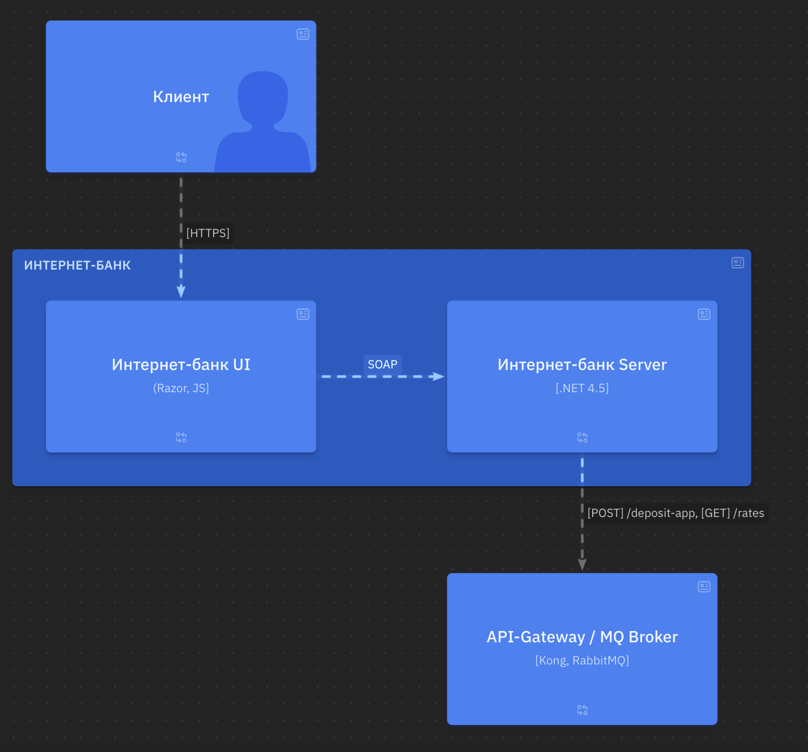
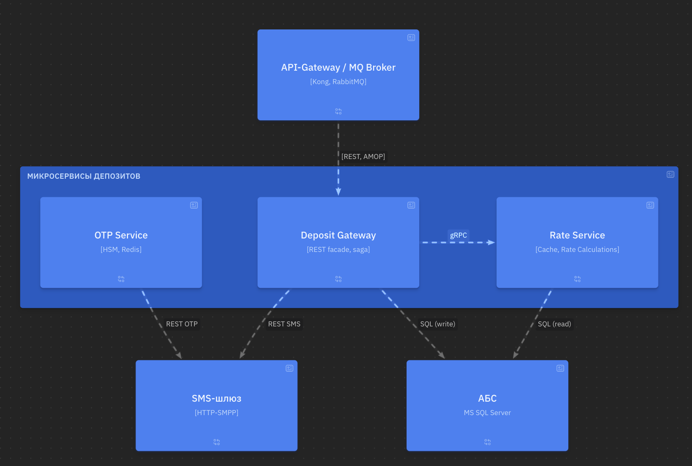

### **Название задачи:** Открытие депозитов онлайн
### **Автор:** olpotkin@gmail.com
### **Дата:** 2025-07-12
### **Функциональные требования**
Опишите здесь верхнеуровневые Use Cases. Их нужно оформить в виде таблицы с пошаговым описанием:

|**№**|**Действующие лица или системы**|**Use Case**|**Описание**|
| :-: | :- | :- | :- |
| 1 | **Клиент (гость)** | Просмотр линейки депозитов | 1. Запрос HTTPS → Website API → Deposit Catalog Service.   2. Deposit Catalog Service отдает актуальные ставки по депозитам. |
| 2 | **Клиент (гость)** | Создать заявку на депозит | 1. Форма «Ф. И. О., телефон»   2. Website API отправляет событие "NewLead" в Integration Bus.   3. Call-центр Platform создаёт заявку. |
| 3 | **Оператор КЦ** | Звонок клиенту и подтверждение деталей | 1. Открывает карточку заявки.   2. Может назначить специальную ставку → событие "SpecialRateRequest". |
| 4 | **Идентифицированный клиент (ИБ)** | Рассчитать персональную ставку | 1. Запрос UI → IB Backend.   2. IB вызывает "Rate Service" → кэш / АБС.   3. Возвращается персональная ставка. |
| 5 | **Идентифицированный клиент (ИБ)** | Подать заявку на депозит | 1. Указывает счёт и сумму.   2. Запрашивает SMS-OTP → "OTP Service" → SMS Gateway.   3. Вводит OTP, IB отправляет "DepositApplication" в Integration Bus. |
| 6 | **Бэк-офис депозитов** | Обработать заявку | 1. Получает задачу из Back-office UI.   2. При необходимости согласует ставку с кредитным аналитиком (в том же UI).   3. Подтверждает в "Deposit Gateway" → запись в АБС. |
| 7 | **Система** | Информировать клиента | 1. После записи в АБС Deposit Gateway публикует "DepositOpened".   2. SMS Gateway отправляет уведомление. |

### **Нефункциональные требования**
Опишите здесь нефункциональные требования и архитектурно значимые требования.

|**№**|**Требование**|
| :-: | :- |
| 1 | Доступность сервисов ≥ 99,9 % (R-1, R-2). |
| 2 | Отказоустойчивость через два ЦОД, горизонтальное масштабирование фронтов и микросервисов (R-1, R-2, S-4). |
| 3 | Время отклика UI ≤ 200 мс; генерация ставки ≤ 100 мс (U-2, P-1). |
| 4 | Все каналы шифруются TLS 1.2+, секреты в Vault (+R-2). |
| 5 | Интеграция каналов ↔ АБС только через "Integration Bus / API-Gateway", без прямых вызовов (+R-1, +R-4). |
| 6 | Собственный "OTP Service" (HTTP+HSM) (F-4). |
| 7 | Используем существующий техстек: .NET 4.5 (ИБ), MS SQL (S-3). |
| 8 | CI/CD-пайплайны, OpenAPI-документация (S-2, S-1). |
| 9 | Ограничение загрузки АБС — все запросы кэшируются, применяются circuit-breaker / throttling (+R-4). |

### **Решение**

1. Context View

2. Container view - Index

2.1 Container view - Website

2.2 Container view - Internet bank

2.3 Container view - Deposit microservices

### </a>**Альтернативы**

| Вариант | Плюсы | Минусы |
|---------|-------|-----------------------|
| Хранить ставки только в АБС, без Rate-Service | Нет дублирования данных | Нагрузка на АБС, медленный расчёт (< 1 с) → нарушает требование P-1 |

**Недостатки, ограничения, риски**

* **Техдолг ASP.NET 4.5** — обновление монолита остаётся трудоёмким.
* **Vertical-only АБС** — при лавинообразном росте он-лайн заявок возможен bottleneck; предусмотрен throttle, но риск остаётся.
* **OTP Service**: требуется HSM-интеграция и регуляторная сертификация — может сдвинуть сроки.
