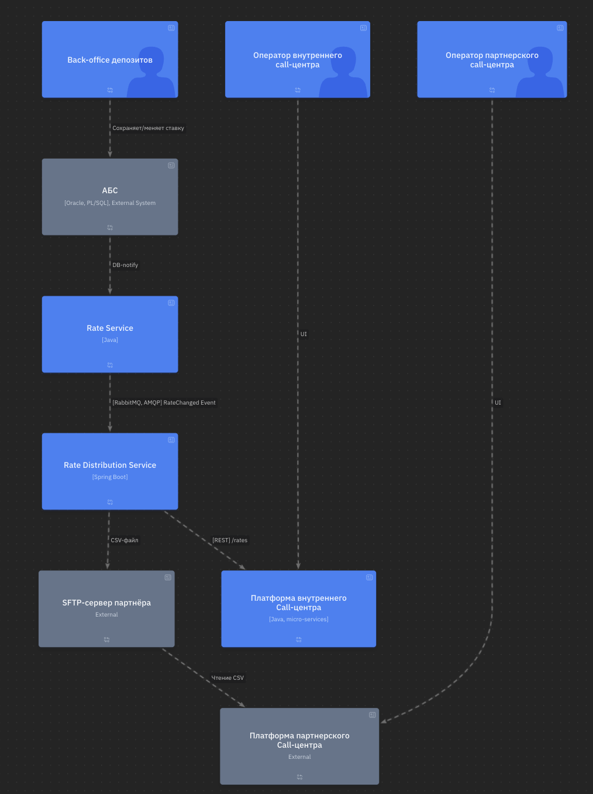
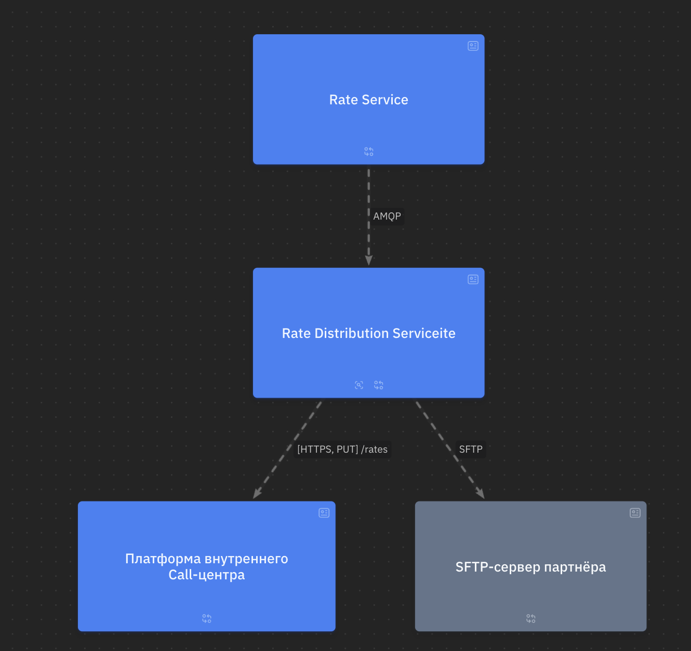
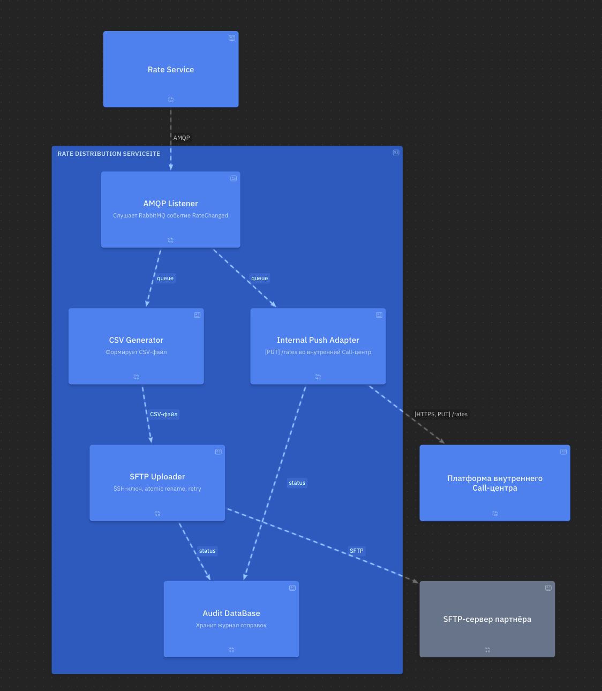

### **Название задачи:** Доставка актуальных депозитных ставок во внутренний и партнёрский call-центры
### **Автор:** olpotkin@gmail.com
### **Дата:** 2025-07-12
### **Функциональные требования**
Опишите здесь верхнеуровневые Use Cases. Их нужно оформить в виде таблицы с пошаговым описанием:

| **№** | **Actor / System** | **Steps** |
|:-:|----------------------------|---------------|
| 1 | Back-office депозитов | Подтверждает/изменяет ставку → АБС сохраняет запись. |
| 2 | Rate Service | Получает событие об изменении ставки из АБС. |
| 3 | Rate Distribution Service | 1. Слушает событие `RateChanged` в брокере.   2. Push-отправка ставки по REST во внутренний Call-центр.   3. Генерация `rates_YYYYMMDD_HHMMSS.csv` и выгрузка на SFTP партнёра. |
| 4 | Платформа внутреннего Call-центра | Принимает REST-запрос, обновляет локальный кеш, показывает ставку оператору. |
| 5 | Система партнёрского Call-центра | Периодически читает каталог SFTP, парсит CSV, обновляет справочник ставок. |

### **Нефункциональные требования**
Опишите здесь нефункциональные требования и архитектурно значимые требования.

|**№**|**Требование**|
| :-: | :- |
| 1 | Максимальная задержка доставки ставки до каждого call-центра ≤ 60 с. |
| 2 | Доступность Rate Distribution Service ≥ 99,9 % (≈ ≤ 43 мин простоя/мес). |
| 3 | Каналы: • REST — HTTPS/TLS 1.2+; • SFTP — SSH v2, обязательная проверка fingerprint. |
| 4 | Минимум 3 ретрая с экспоненциальной задержкой при сбоях REST или SFTP. |
| 5 | Только существующий техстек банка: Java 17/Spring Boot, RabbitMQ, MS SQL/Oracle. |
| 6 | Прямых вызовов Call-центр → АБС нет. |

### **Решение**

1. Context View

2. Container view - Index

2.1 Container view - Rate Distribution Service

### **Альтернативы**

| № | Вариант | Причина отказа |
|---|-----------------------|----------------|
| 1 | Встроить REST-API ставок прямо в платформу Call-центра | Партнёрский Call-центр всё равно требует файл; усложняется безопасность (открытый API наружу). |
| 2 | Отправлять Excel-файл по e-mail (старый процесс) | Ручная обработка, задержка > 5 мин, высокий риск ошибок ввода. |

**Недостатки, ограничения, риски**

* **Зависимость от SFTP-канала** — нет SLA у партнёра → возможны простои > 1 мин.
* **Формат CSV** жёсткий: любое добавление колонки требует согласования с партнёром.
* **RabbitMQ** выбран как быстрый старт; при дальнейшем переходе банка на Kafka понадобится миграция слушателей.
* Если ставка отозвана/исправлена после выгрузки — нужно доп. событие `RateRevoke`, иначе у Call-центра останется неактуальная цифра.

## RoadMap

Файл: [road_map.drawio](road_map.drawio)
